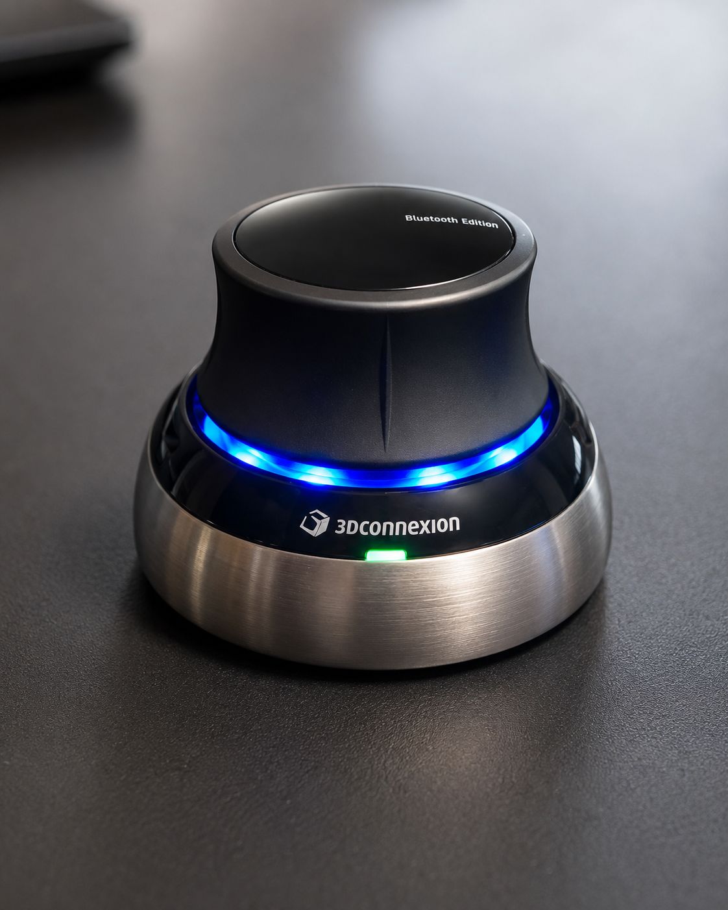
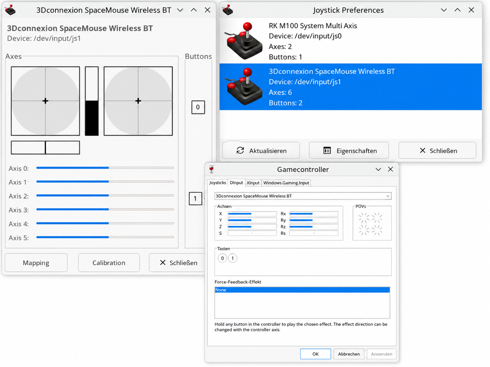

# Hardware and detection

## Tested hardware

The tested reference is a 3Dconnexion SpaceMouse Wireless BT connected over
USB with identity `256f:c63a`. Linux reports six axes and two buttons for this
device. USB is the only confirmed transport.

*AI-assisted illustrative documentation image; not raw private audit
evidence.*

The documented reference environment used NixOS 26.05 with
[nix-citizen](https://github.com/LovingMelody/nix-citizen) and the
`wine-astral` 11.12 package supplied through that project. The implementation
in this repository remains an independent, SpaceMouse-specific integration.

## Native Linux detection

The Linux kernel and input stack associate the hardware with HIDRAW, event,
and joystick node types. Node numbers are assigned dynamically. Values such as
`/dev/input/js0` and `/dev/input/js1` in the illustration are runtime examples
and must never be hardcoded. Hardware identity is confirmed through the
canonical USB ancestor and its VID:PID rather than a leaf node name.

## Wine detection

The controller is visible in the Wine controller interface. Wine visibility
is separate from native Linux detection and does not prove that Star Citizen
accepts input. Binding and gameplay were separately validated during the
historical manual test.

## Live read-only audit result

The 2026-08 live audit detected one USB SpaceMouse and confirmed VID:PID
`256f:c63a`. HIDRAW, event, and joystick node types resolved to the same
canonical USB ancestor, and effective HIDRAW read and write access succeeded.
The active Udev policy remained narrowly scoped.

No device event, joystick event, or Raw HID report was consumed. No Udev rule,
ACL, group membership, Wine state, Star Citizen file, or system configuration
was changed.

## Verified gameplay result

The separately documented manual test established that all six axes worked,
vertical direction was corrected through the documented inversion, and no
drift or cross-axis input was observed. Shared movement bindings worked for
flight and ground vehicles in the tested Star Citizen build. This gameplay
test was not repeated during the read-only audit.

## Image provenance

See [the image provenance notes](images/README.md). The visuals are
AI-assisted illustrative documentation, not raw forensic evidence. The
functional/security audit and reproducible tests remain the authoritative
technical evidence.

## Support boundaries

USB `256f:c63a` is the tested reference. Bluetooth and Universal Receiver
operation remain unverified, and other products may use different identities.
Runtime node numbers may change. Future Linux, Wine, Nix-Citizen, and Star
Citizen versions may require renewed validation.

Related documentation:

- [2026-08 functional and security audit](audits/2026-08-functional-security-audit.md)
- [Star Citizen integration](star-citizen.md)
- [Tested Star Citizen profile](../profiles/star-citizen/README.md)
- [Troubleshooting](troubleshooting.md)
